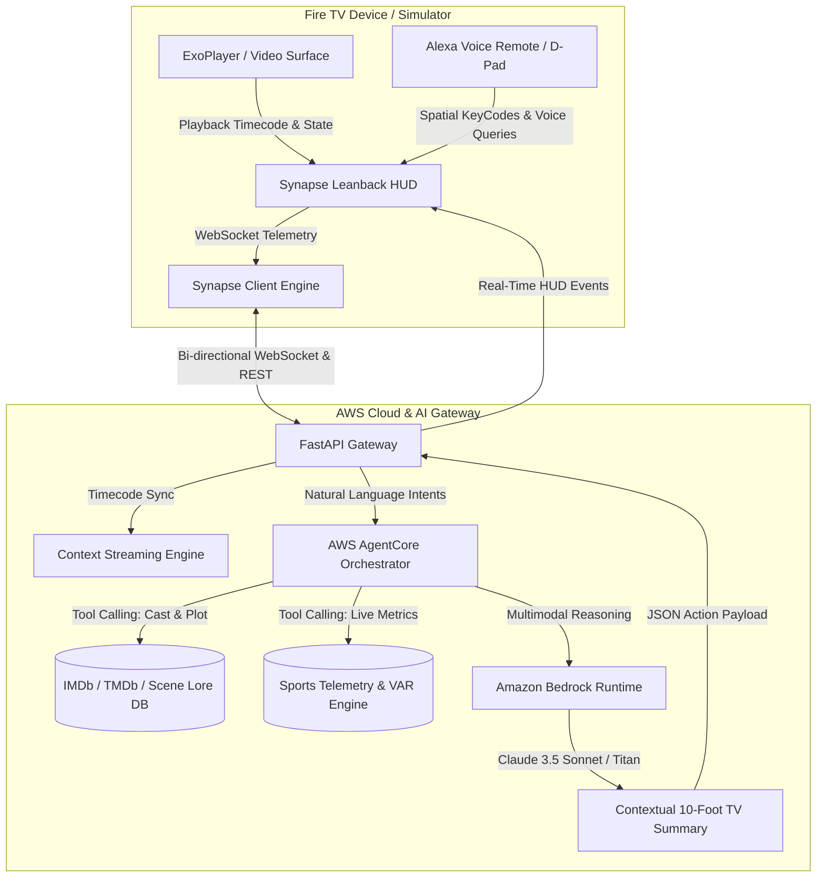

# SynapseTV 📺⚡

> **Contextual, Multimodal On-Screen Co-Pilot for Amazon Fire TV**  
> *Built for the "Build, Ship, Shape: Amazon Developer Hackathon" (Fire TV Track, AWS Builder & Open Source Challenges).*

[](https://opensource.org/licenses/MIT)
[](https://aws.amazon.com/bedrock/)
[](https://aws.amazon.com/bedrock/claude/)
[](https://developer.amazon.com/fire-tv)
[](https://developer.amazon.com/docs/fire-tv/design-and-user-experience-guidelines.html)

---

## 🌟 Executive Summary

**SynapseTV** eliminates "second-screen fatigue" by embedding an intelligent, multimodal AI co-pilot directly into the Fire TV on-screen viewing experience. Rather than looking down at a smartphone to search IMDb or sports statistics, viewers receive synchronized contextual annotations, character recaps, and real-time sports telemetry directly on their TV screen through a translucent HUD navigated with the Fire TV Alexa Voice Remote and D-Pad.



---

## ✨ Key Capabilities

### 1. 🎬 Dynamic Scene Catch-Up
- **Instant Character Spotlights**: Automatically identifies on-screen actors and character dynamics at key narrative turning points.
- **Spoiler-Free Plot Recap**: Summarizes past story arcs leading up to the exact timecode without revealing future twists.
- **Behind-The-Scenes Trivia**: Surface production notes and filming trivia synchronized with visual cues.

### 2. ⚽ Real-Time Sports Telemetry & Trivia
- **Live Match Metrics**: Track possession percentages, Expected Goals (xG), and high-press turnover rates.
- **Sprint Speed Alerts**: Instant notifications when players break match sprint records (e.g. 34.8 km/h).
- **VAR & Offside Explainer**: Clear, lean-back breakdowns of complex refereeing decisions and Semi-Automated Offside Technology (SAOT).

### 3. 🎙️ Alexa Voice Remote Multimodal Q&A
- **Natural Voice Interaction**: Hold the mic key (or press `V`) to ask questions like *"Who is that actor?"* or *"Explain the offside ruling"*.
- **Sub-Second Lean-Back Answers**: Amazon Bedrock with Claude 3.5 Sonnet generates punchy, high-contrast bulleted answers formatted for 10-foot TV viewing.

---

## 🛠️ Architecture & Tech Stack

| Layer | Technologies Used | Description |
| :--- | :--- | :--- |
| **TV Frontend** | React 18, Vite, Lucide Icons, Vanilla CSS Design System | 1080p/4K TV safe zones, spatial D-pad navigation, focus rings, glassmorphism |
| **AI Orchestration** | Amazon Bedrock (`anthropic.claude-3-5-sonnet`, `amazon.titan-multimodal-embed-v1`) | Multimodal video frame, subtitle, and intent parsing |
| **Tool Orchestration** | AWS AgentCore Specification | Tool routing for actor metadata, sports telemetry, and scene lore |
| **Backend Gateway** | Python 3.10+, FastAPI, Uvicorn, WebSockets, Pydantic | Sub-10ms timecode event dispatch and voice query streaming |
| **Testing & CI** | Pytest, Asyncio, Vitest | End-to-end unit and integration test suites |

---

## 🚀 Step-by-Step Quickstart

### Prerequisites
- **Node.js**: v18.0.0 or higher
- **Python**: v3.10 or higher
- **AWS Account** (optional; mock fallback mode is enabled by default for zero-friction evaluation)

### 1. Clone Repository & Setup Environment
```bash
git clone https://github.com/your-username/synapse-tv.git
cd synapse-tv
```

### 2. Launch AI Orchestration Gateway (Backend)
```bash
# Navigate to server directory
cd server

# Install Python dependencies
pip install -r requirements.txt

# (Optional) Set AWS Bedrock Credentials in .env
# AWS_REGION=us-east-1
# AWS_ACCESS_KEY_ID=your_key
# AWS_SECRET_ACCESS_KEY=your_secret

# Start FastAPI Gateway
python main.py
```
*The server will be live at `http://127.0.0.1:8000` (Swagger docs at `/docs`).*

### 3. Launch Fire TV Client Simulator (Frontend)
```bash
# Open a new terminal and navigate to client
cd client

# Install dependencies
npm install

# Start local TV dev server
npm run dev
```
*Open `http://localhost:5173` in your browser or Fire TV WebView simulator.*

---

## 🎮 Fire TV Remote Controls & Key Mappings

SynapseTV fully complies with Fire OS / Android Leanback keycodes:

| Action | Fire TV Remote Key | Keyboard Mapping | Virtual Remote |
| :--- | :--- | :--- | :--- |
| **Navigate** | D-Pad Directional Ring | `Arrow Keys` (↑, ↓, ←, →) | Circular D-Pad |
| **Select / Enter** | Center OK Button (KeyCode 23) | `Enter` (KeyCode 13) | Center 'OK' button |
| **Back / Dismiss** | Back Button (KeyCode 4) | `Escape` / `Backspace` | Back Button |
| **Play / Pause** | Play/Pause Button (KeyCode 85) | `Spacebar` | Play/Pause Button |
| **Voice Co-Pilot** | Microphone Button (Hold) | `V` Key | Glowing Mic Icon |
| **Mode Switch** | Menu Button (KeyCode 82) | Click Mode Pill | 'Mode' Toggle Pill |

---

## 🧪 Running Automated Tests

Run the backend test suite verifying AWS Bedrock integration, AgentCore tools, and WebSockets:

```bash
cd server
python -m pytest tests/ -v
```

*Expected output: 11 passed tests covering tool execution, scene analysis, and real-time streaming.*

---

## 📂 Repository Structure

```
amazonappdev2026/
├── LICENSE                               # MIT License
├── README.md                             # Monorepo Guide & Architecture
├── client/                               # Fire TV Client App (React / Leanback)
│   ├── index.html                        # 10-foot TV HTML Entrypoint
│   ├── package.json                      # Pinned Client Dependencies
│   ├── vite.config.js                    # Vite Configuration
│   └── src/
│       ├── App.jsx                       # Master Fire TV Viewport & Remote Manager
│       ├── index.css                     # Glassmorphic TV Design System
│       ├── components/
│       │   ├── VideoPlayer.jsx           # ExoPlayer Wrapper & Timecode Streamer
│       │   ├── LeanbackHUD.jsx           # Translucent TV HUD Overlay
│       │   ├── SceneCatchUpCard.jsx      # Character & Plot Context Widget
│       │   ├── SportsTelemetryOverlay.jsx# Live xG & Sprint Metrics Widget
│       │   ├── VoicePromptModal.jsx      # Alexa Voice Remote Q&A Modal
│       │   └── VirtualRemote.jsx         # On-Screen Fire TV Remote Simulator
│       └── hooks/
│           ├── useDPadNavigation.js      # Spatial Focus & KeyCode Hook
│           └── useSynapseWebSocket.js    # Timecode & Voice WebSocket Sync
├── server/                               # Context & AI Orchestration Gateway
│   ├── requirements.txt                  # Python Backend Dependencies
│   ├── main.py                           # FastAPI & WebSocket Router
│   ├── config.py                         # AWS & Bedrock Configuration
│   ├── bedrock_agent.py                  # Bedrock Claude 3.5 Sonnet Integration
│   ├── agent_core.py                     # AWS AgentCore Tool-Calling Orchestrator
│   ├── context_streamer.py               # Video Timecode Ingestion Engine
│   ├── data/
│   │   ├── sample_movies.json            # Sci-Fi / Drama Scene Metadata
│   │   └── sample_sports.json            # Premier League Match Telemetry
│   └── tests/
│       ├── test_bedrock_agent.py         # Bedrock Agent Unit Tests
│       ├── test_agent_core.py            # AgentCore Tool Unit Tests
│       └── test_websocket_stream.py      # WebSocket Integration Tests
└── hackathon-submission/                 # Devpost Submission Package
    ├── 01_project_overview.md            # Title, Tagline, Tags
    ├── 02_project_story.md               # Devpost Markdown Story
    ├── 03_mini_challenges.md             # AWS Builder & Open Source Write-ups
    ├── 04_feedback_and_friction_log.md   # Feedback Q1-Q5 & Friction Log
    └── 05_demo_video_script.md           # 2m45s Timed Demo Video Script
```

---

## 📄 License & Open Source Declaration

This project is open source and licensed under the **MIT License**. See [`LICENSE`](./LICENSE) for full details.
Contributions, issues, and feature requests are welcome!
